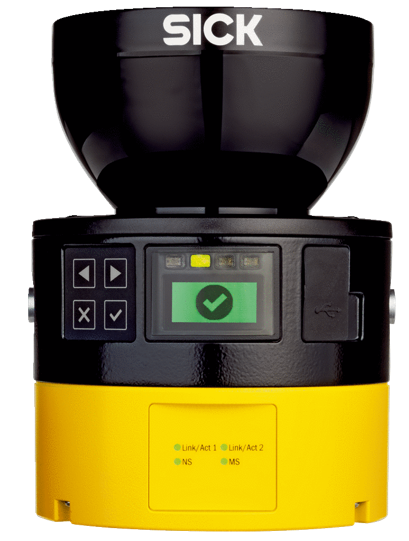

# Sick_Safetyscanners CPP Driver

## Table of contents

- [Supported Hardware](#supported-hardware)
- [Getting started](#getting-started)
- [API](#api)
- [Creators](#creators)

A CPP standalone Driver which reads the raw data from the SICK Safety Scanners and takes custom functions to publish the data.

## Supported Hardware



| Product Family  | Product Type | Description |
| ---------------------- | -------------------- | ------------- |
| microScan3 Core | MICS3-ACAZ40PZ1 | Safety Laser Scanner, PROFINET PROFIsafe, Protective Field Range: 4 m |
|  | MICS3-ACAZ55PZ1 | Safety Laser Scanner, PROFINET PROFIsafe,  Protective Field Range: 5.5 m |
|  | MICS3-ACAZ90PZ1 | Safety Laser Scanner, PROFINET PROFIsafe,  Protective Field Range: 9 m |
|  | MICS3-ABAZ40IZ1 | Safety Laser Scanner, EtherNet/IP CIP Safety,  Protective Field Range: 4 m |
|  | MICS3-ABAZ55IZ1 | Safety Laser Scanner, EtherNet/IP CIP Safety, Protective Field Range: 5.5 m |
|  | MICS3-ABAZ90IZ1 | Safety Laser Scanner, EtherNet/IP CIP Safety, Protective Field Range: 9 m |
|  | MICS3-ABAZ40ZA1 | Safety Laser Scanner, EFI-pro,  Protective Field Range: 4 m |
|  | MICS3-ABAZ55ZA1 | Safety Laser Scanner, EFI-pro, Protective Field Range: 5.5 m |
|  | MICS3-ABAZ90ZA1 | Safety Laser Scanner, EFI-pro, Protective Field Range: 9 m |
|  |  |  |
| microScan3 Pro | MICS3-CBAZ40PZ1 | Safety Laser Scanner, PROFINET PROFIsafe, Protective Field Range: 4 m |
|  | MICS3-CBAZ55PZ1 | Safety Laser Scanner, PROFINET PROFIsafe,  Protective Field Range: 5.5 m |
|  | MICS3-CBAZ90PZ1 | Safety Laser Scanner, PROFINET PROFIsafe,  Protective Field Range: 9 m |
|  | MICS3-CBAZ40IZ1 | Safety Laser Scanner, EtherNet/IP CIP Safety,  Protective Field Range: 4 m |
|  | MICS3-CBAZ55IZ1 | Safety Laser Scanner, EtherNet/IP CIP Safety, Protective Field Range: 5.5 m |
|  | MICS3-CBAZ90IZ1 | Safety Laser Scanner, EtherNet/IP CIP Safety, Protective Field Range: 9 m |
|  | MICS3-CBAZ40ZA1 | Safety Laser Scanner, EFI-pro,  Protective Field Range: 4 m |
|  | MICS3-CBAZ55ZA1 | Safety Laser Scanner, EFI-pro, Protective Field Range: 5.5 m |
|  | MICS3-CBAZ90ZA1 | Safety Laser Scanner, EFI-pro, Protective Field Range: 9 m |
|  |  |  |
| outdoorScan3 Pro | MICS3-CBUZ40IZ1P01 | Safety Laser Scanner, EtherNet/IP CIP Safety, Protective Field Range: 4 m |
|  |  |  |

## Getting started

The driver will be released on this github repository, and can then be installed from source.

### Prerequisites

* Linux
* Correctly setup SICK Safety Scanner
* Connected SICK Safety Scanner and a correctly setup ethernet network. Both the host and the sensor have to be in the same network.

### Installation

For installation this github repository has to be cloned and afterwards installed. If a custom install directory is wanted use the -DCMAKE_INSTALL_PREFIX option to specify a path.

```bash
git clone https://github.com/SICKAG/sick_safetyscanners_base.git
cd sick_safetyscanners_base
mkdir build
cd build
cmake -DCMAKE_INSTALL_PREFIX=<path to install folder> ..
make -j9
make install
```

### Usage

To use the library in a driver the path of the installation has to be added to the cmake prefix path of your application. You can achieve this by using, bevor invoking cmake on your application.

```
export CMAKE_PREFIX_PATH=<path to install folder>
```

Afterwards the driver and the settings for the driver can be included with:
```
#include <sick_safetyscanners/SickSafetyscanners.h> 
#include <sick_safetyscanners/datastructure/CommSettings.h>
```

To setup the driver one has to invoke the constructor and pass a function and the settings for communication.

```
sick::datastructure::CommSettings m_communication_settings;

#Set the correct parameters for the communication settings, otherwise the default parameters will be used. 
#For example:
m_communication_settings.setHostIp("192.168.1.100");
"TODO write defaults or API!!!"

std::shared_ptr<sick::SickSafetyscanners> m_device;
m_device = std::make_shared<sick::SickSafetyscanners>(boost::bind(&your_class::your_function, this, _1), &m_communication_settings);
m_device->run();  
```

With the passed function having the following declaration:

```
void your_function(const sick::datastructure::Data& data) ;
```

An Example can be found in the sick_safetyscanners ROS Driver: https://github.com/SICKAG/sick_safetyscanners/blob/master/src/SickSafetyscannersRos.cpp

## API

### Default Parameters of Communication Settings

The parameters can be set using the setters of the CommSettings class. To set for example to host_ip the following function can be called.

```
sick::datastructure::CommSettings m_communication_settings;
m_communication_settings.setHostIp("192.168.1.100");
```

| Parameter Name        | API | Default  | Information |
| -------------                         | ------|------- | ------------- |
| sensor_ip                    | void setSensorIp(const std::string& sensor_ip); | 192.168.1.11  |Sensor IP address. Can be passed as an argument to the launch file. |
| host_ip                        |   void setHostIp(const std::string& host_ip);  | 192.168.1.9  | Host IP address.  Can be passed as an argument to the launch file.  |
| host_udp_port             | void setHostUdpPort(const uint16_t& host_udp_port);  | 0 | Host UDP Port.  Can be passed as an argument to the launch file.  Zero allows system chosen port. |
| frame_id  | String | scan | The frame name of the sensor message  |
| skip    | Integer | 0 | The number of scans to skip between each measured scan.  For a 25Hz laser, setting 'skip' to 0 makes it publish at 25Hz, 'skip' to 1 makes it publish at 12.5Hz. |
| angle_start              | Double |  0.0 | Start angle of scan in radians, if both start and end angle are equal, all angels are regarded.  0° is at the front of the scanner. |
| angle_end                | Double | 0.0 | End angle of scan in radians, if both start and end angle are equal, all angels are regarded.  0° is at the front of the scanner. |
| channel_enabled     | void setEnabled(bool enabled); | true | If the channel should be enabled  |
| general_system_state  | Boolean | true | If the general system state should be published  |
| derived_settings      | Boolean | true | If the derived settings should be published  |
| measurement_data  | Boolean | true | If the measurement data should be published  |
| intrusion_data          | Boolean | true | If the intrusion data should be published  |
| application_io_data  | Boolean | true | If the application IO data should be published  |
| use_persistent_config | Boolean |  false | If this flag is set, the configured angles from the sensor are loaded and used and the ROS parameters *angle_start* and *angle_end* are disregarded|


### Functions

### Troubleshooting

* Check if the sensor has power and is connected to the host.
* Check if both sensor and host are in the same subnet e.g. 192.168.1


## Creators

**Lennart Puck** 

FZI Forschungszentrum Informatik


- <http://www.fzi.de>

on behalf of SICK AG 

- <http://www.sick.com>


